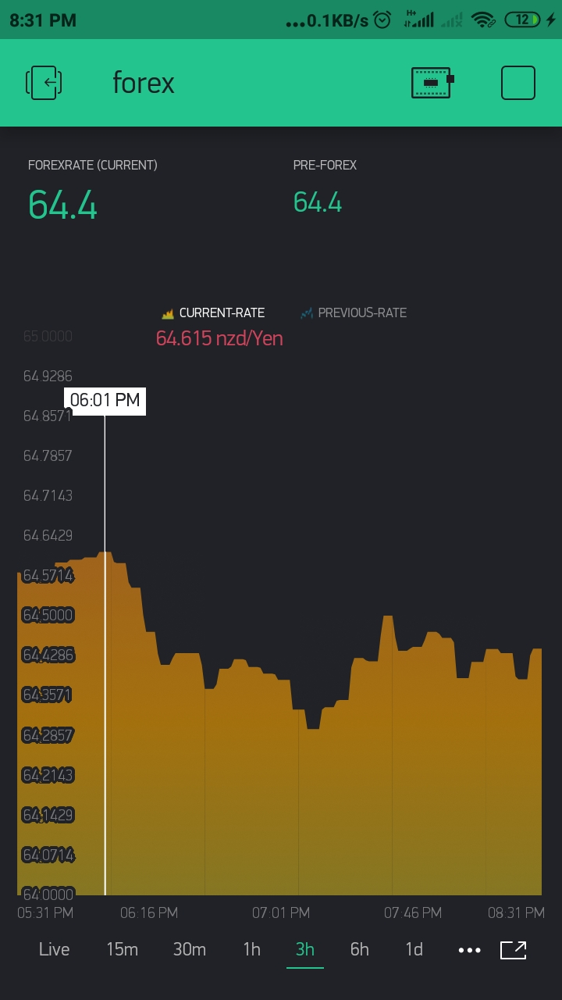

# forex-tracker

## Introduction
An IoT project developed with the help of NodeMCU to detect changes in any two currency systems with notification application for android.

## How it works 
The ESP8266 connects to the internet via Wi-Fi and grabs the Forex Rates every 10 seconds. Based on the movement of this value, it sends a UART message to the Arduino Uno (Rise/Fall/Unchanged). The NodeMCU receives this UART message and accordingly lights up an indication LED (Green/Red/Yellow).

## Technologies we have used  
* Arduino IDE   
* Blynk App  
* Thingspeak  
* ESP8266-NODEMCU   

- Sample of our notification application on phone
## Contributers:
##### * <a href="https://github.com/deepakg1105">  Deepak Kumar Gupta</a>
##### * <a href="https://github.com/avi-27">  Avi Singh</a>  

